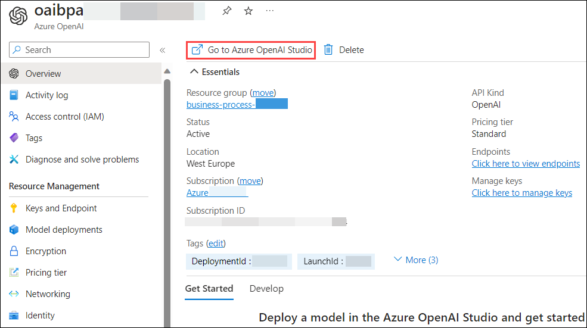
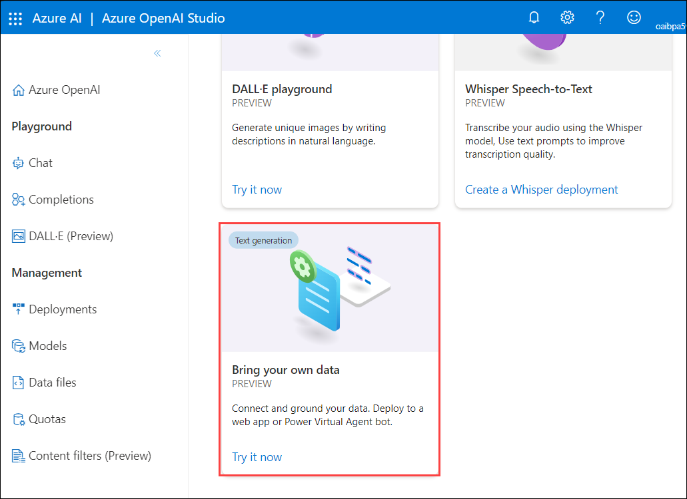
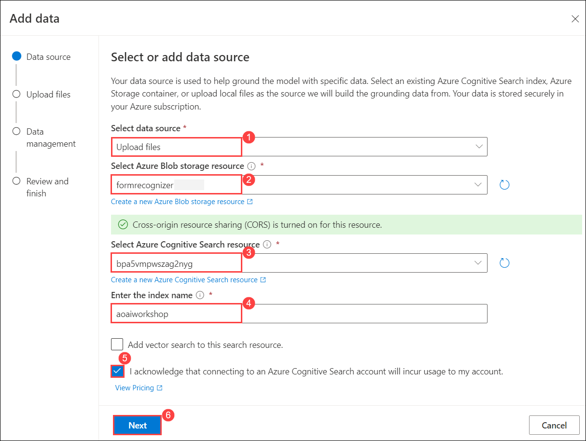
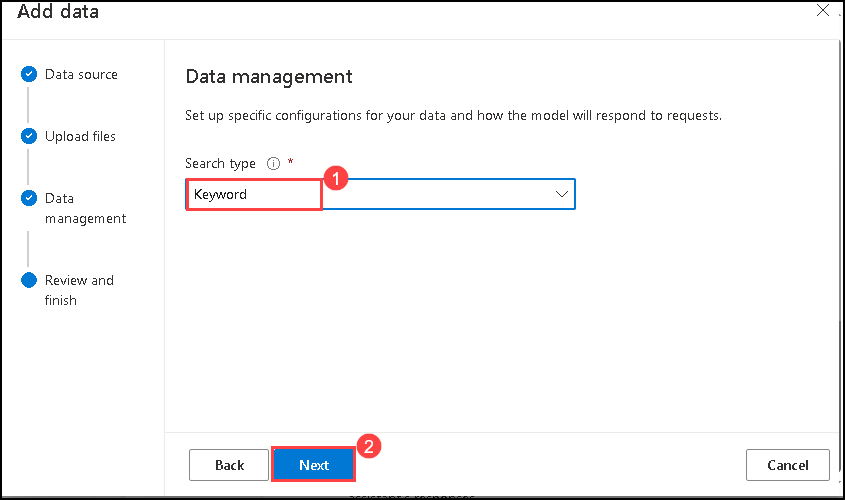
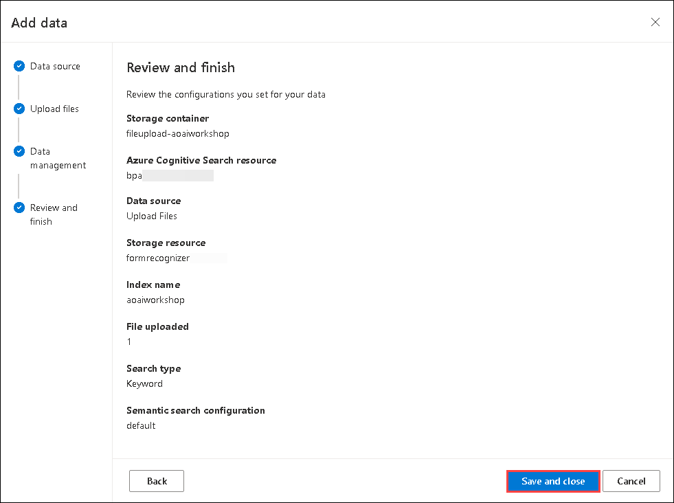
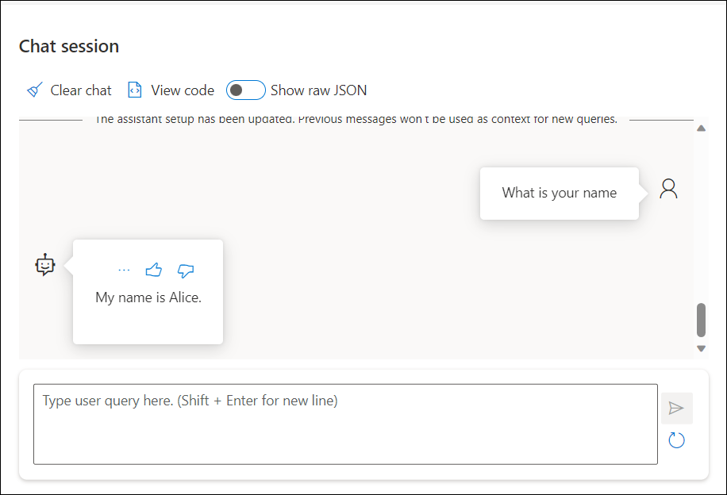
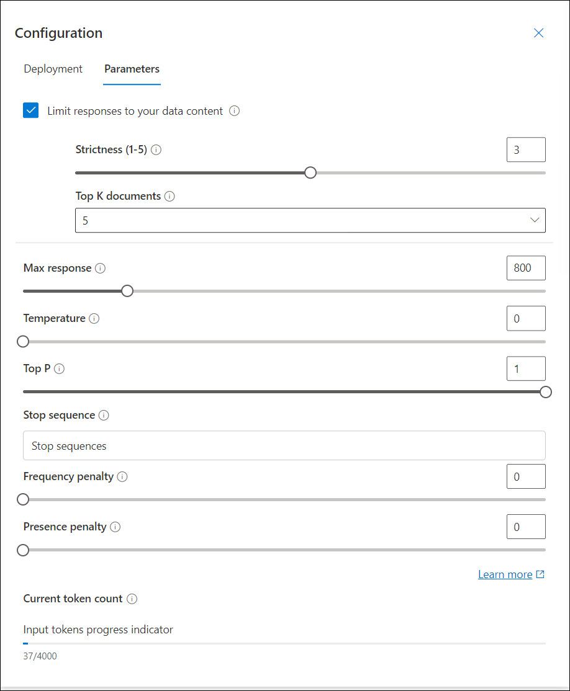

# Use Azure OpenAI with your own data

### Overview
In this lab, you will be using your own data with Azure OpenAI Large Language Models(LLM) which will be made searchable using Azure Cognitive Search. You will be using the Porche Owner's Manual pdf provided under [Lab 2](/SampleInvoices/Lab%202/) folder.


### Goal
* How to leverage the chatGPT LLM to extract a concise summary from your own document repository using OpenAI.

### Pre-requisites
* Access to Azure OpenAI chat playground
* Sample data to test with OpenAI

### Instructions

### Task 1: Navigate to Azure OpenAI Playground

1. Navigate back to the Resource Group and select the resource group **business-process-<inject key="Deployment ID" enableCopy="false"/>**.

   

2. On the Resource group, search, and select the **Azure OpenAI** resource type, with the name similar **oaibpa{suffix}**.

   

3. On the **Azure OpenAI** page, click on **"Go to Azure OpenAI Studio"**

   

4. On the **Azure OpenAI Studio**, scroll down click on **"Bring your own data"**

   

### Task 2: Upload your own data
In this step, we will be using Porche's owner manual for Taycan, Panamera and Cayenne models.

1. Fill in the fallowing details in **Select or add data source** and click on **Next** **(6)**.
    
    - Select data source: **Upload files** **(1)**
    - Select Azure Blob storage resource: Choose the already created storage account from the dropdown **(2)**. If asked, enable CORS.
    - Select Azure Cognitive Search resource: Select the search service used in the previous lab from the dropdown **(3)**.
    - Enter the index name: Give an index name as **aoaiworkshop** **(4)**
    - Check the **I acknowledge that connecting to an Azure Cognitive Search account will incur usage to my account** **(5)**.

    

2. On the **Data Management**, click on **Browse** **(1)** file explorer enter the following `C:\Users\Public\Desktop\Data\Lab 2` **(2)** path and hit enter, select the **Panamera-from-2021-Porsche-Connect-Good-to-know-Owner-s-Manual** **(3)** pdf  file and click on **Open** **(4)** files.

   

3. It will redirect to **Data Management**, click on **Upload files** **(1)**, and click on **Next** **(2)**.

   

4. On the **Data Management** page, from the drop-down select **keyword** as Search type 

   

5. On the **Review and finish** page, click on **Save and close**.

   

### Task 3: Interact with Azure OpenAI chatGPT LLM using your own data

1. Under the **Assistant Setup** pane, wait until your data upload is finished.

   

2. Under the **Chat Session** pane, you can start testing out your prompts by entering the query like.

    ```
    how to operate Android Auto in Porche Taycan? give step-by-step instructions
    ```

      

3. You can also configure the responses of your bot by selecting the system message under **Assistance Setup**, and click on **System message** **(2)** to replace the value under the system message with `Your name is Alice. You are an AI assistant that helps people find information about Porche cars. Your responses should not contain any harmful information`  **(2)** and click on **Save Changes** **(4)**. Here we have edited the default system message.

   

4. On **Update system message?** pop-up, click on **Continue**.

   

5. Under the **Chat Session** pane, you can start testing out your prompts by entering the query like.

    ```
     What is your name
    ```
   
   

6. In the **Configuration** pane click on **Parameters**, you can try and experiment with different parameter configuration to see how it changes the behavior of the model

   
