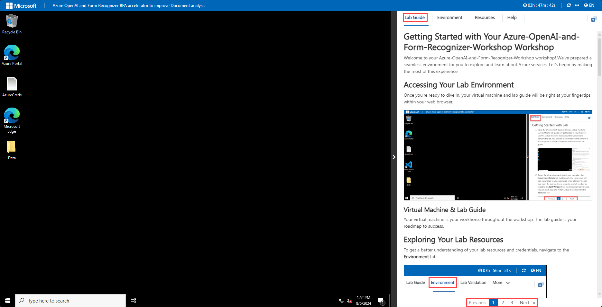
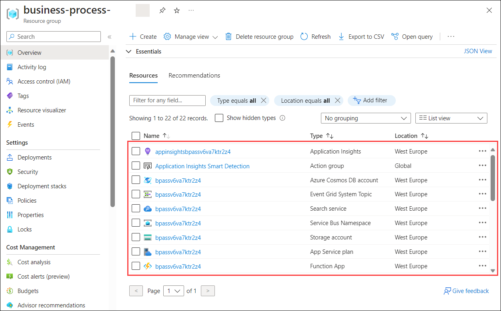

# Azure OpenAI and Azure AI Document Intelligence BPA accelerator to improve Document Analysis
 
## Overall Estimated Duration: 2 Hours

## Overview

In this lab, you will gain a comprehensive understanding of Azure's advanced data handling and analysis tools. You'll explore how to utilize Azure OpenAI Large Language Models (LLM) and Azure AI Search to make your data searchable. Additionally, you'll delve into creating custom models with Azure AI Document Intelligence, learning how to extract and analyze specific data from business forms and documents. This lab will showcase the potential of these technologies to build intelligent systems tailored to your business needs, enhancing productivity and delivering hyper-personalized experiences.

## Objective

Understand how to create and deploy an Azure AI Document Intelligence custom model in Azure, train data, and configure Azure AI Search. Gain skills in building custom model pipelines and streamlining document data extraction. By the end of this lab, you will be able to:

- **Create and Deploy an Azure AI Document Intelligence Custom Model**: Understand how to streamline document data extraction and enhance efficient information retrieval by creating an Azure AI Document Intelligence resource, training data, building a custom model pipeline in BPA, and configuring Azure AI Search. 

- **Use Azure OpenAI with your own data**: Understand how to navigate the Azure OpenAI Playground, upload your own data, and interact with ChatGPT LLM to customize responses and gain insights from your data.

## Pre-requisites

- Familiarity with Azure’s suite of AI tools.
- Basic knowledge of BPA and how to build and manage data processing pipelines.

## Architecture

In this lab, you'll first create custom models with Document Intelligence, focusing on extracting and analyzing specific data from business forms and documents. Next, you will leverage Azure's advanced data handling tools by using Azure OpenAI Large Language Models (LLM) in conjunction with Azure AI Search to make your data searchable and accessible. The architecture flow integrates these components to build intelligent systems that enhance productivity and deliver personalized experiences, demonstrating the powerful capabilities of Azure's AI and data analysis technologies tailored to your business needs.

## Architecture Diagram

 

### Explanation of Components

**Ingest**: This stage involves collecting various types of data, such as text, audio, images, and video. These data types are the raw inputs that need to be processed and analyzed.

**Storage**: The collected data is stored in a scalable storage solution. This component ensures that the ingested data is securely saved and can be accessed by other services when needed.

**Trigger**: This component monitors the storage and triggers actions when new data is available. It uses a message queue to manage the data processing workflow efficiently.

**Pipeline Executor**: The pipeline executor, often powered by Azure Functions, runs the necessary code in response to the trigger events. It processes the data and passes it to the cognitive services for further analysis.

**Azure AI Services**: This stage involves multiple cognitive services, which can include natural language processing, image recognition, and other AI-powered features. These services analyze the data and extract meaningful insights.

**Storage**: After processing, the data and extracted insights are stored again. This ensures that the results of the cognitive services are saved for later use, such as visualization or further analysis.

**Visualize**: The final component involves visualizing the processed data and insights. Users can view real-time outputs or interact with the data through a chatbot UI or other visualization tools.

This architecture flow demonstrates how various Azure components work together to handle, process, analyze, and visualize data, providing a comprehensive and intelligent system tailored to business needs.

## **Getting Started with the Lab**
 
1. After the environment has been set up, your browser will load a virtual machine (JumpVM), use this virtual machine throughout the workshop to perform the lab. You can see the number on the bottom of the lab guide to switch to different exercises in the lab guide.

   
 
2. To get the lab environment details, you can select the Environment tab. Additionally, the credentials will also be emailed to your registered email address. You can also open the Lab Guide in a separate and full window by selecting the Split Window from the lower right corner. Also, you can start, stop, and restart virtual machines from the Resources tab.
 
   .png)
 
## **Utilizing the Split Window Feature**
 
For convenience, you can open the lab guide in a separate window by selecting the **Split Window** button from the Top right corner.
 
   .png)
 
## **Managing Your Virtual Machine**
 
Feel free to start, stop, or restart your virtual machine as needed from the **Resources** tab. Your experience is in your hands!

   
 
## **Let's Get Started with Azure Portal**
 
1. On your virtual machine, click on the **Azure Portal** icon as shown below:
 
    .png)

1. On the **Sign in to Microsoft Azure** tab you will see the login screen, in that enter the following email/username, and click on **Next**. 

   * **Email/Username**: <inject key="AzureAdUserEmail"></inject>
   
      
     
1. Now enter the following password and click on **Sign in**.
   
   * **Password**: <inject key="AzureAdUserPassword"></inject>
   
      
     
1. If you see the pop-up **Stay Signed in?**, select **No**.

1. If you see the pop-up **You have free Azure Advisor recommendations!**, close the window to continue the lab.

1. If a **Welcome to Microsoft Azure** popup window appears, select **Maybe Later** to skip the tour.
   
1. Now you will see the Azure Portal Dashboard, click on **Resource groups** from the Navigate panel to see the resource groups.

   
   
1. Confirm that you have all resource groups present as shown below.

   
   
1. Verify the resources deployed in the resource group.

   
   
> [!IMPORTANT]
*For a smoother experience during the hands-on lab, it's important to thoroughly review both the instructions and the accompanying notes. This will help you navigate through the tasks with ease and confidence.*

This hands-on lab will guide you in using Azure’s advanced tools, including OpenAI LLM, Azure AI Search, and Azure AI Document Intelligence, to create intelligent systems that enhance productivity and deliver personalized experiences.

## Support Contact

The CloudLabs support team is available 24/7, 365 days a year, via email and live chat to ensure seamless assistance at any time. We offer dedicated support channels tailored specifically for both learners and instructors, ensuring that all your needs are promptly and efficiently addressed.

Learner Support Contacts:

- Email Support: labs-support@spektrasystems.com
- Live Chat Support: https://cloudlabs.ai/labs-support
  
Now, click on Next from the lower right corner to move on to the next page.

## Happy Learning!!

