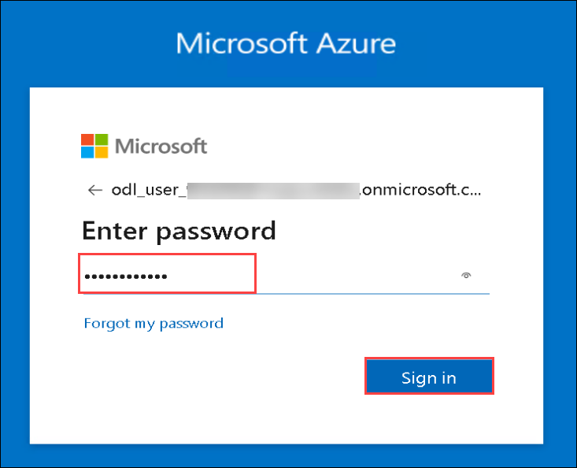

# **Getting Started with Your Azure-OpenAI-and-Form-Recognizer-Workshop Workshop**
 
## **Overall Estimated Duration: 2 Hours**

## **Overview**

In this lab, you will gain a comprehensive understanding of Azure's advanced data handling and analysis tools. You'll explore how to utilize Azure OpenAI Large Language Models (LLM) and Azure Cognitive Search to make your data searchable. Additionally, you'll delve into creating custom models with Azure Form Recognizer, learning how to extract and analyze specific data from business forms and documents. This lab will showcase the potential of these technologies to build intelligent systems tailored to your business needs, enhancing productivity and delivering hyper-personalized experiences.

## **Objective**

•**Creating a Form Recognizer Resource**: This hands-on exercise aims to create a Form Recognizer resource in Azure, ensuring that you have the necessary setup to build and train custom models for data extraction from forms and documents.
•**Train and Label Data**:This hands-on exercise focuses on training and labeling a dataset to create a custom model with Azure Form Recognizer, enabling the extraction of specific data points from business forms and documents.
•**Build a New Pipeline with the Custom Model Module in BPA**: This hands-on exercise aims to build a new pipeline using the custom model module in Business Process Automation (BPA), facilitating streamlined processing and analysis of form data within your business workflows.
•**Configure Azure Cognitive Search**: This hands-on exercise aims to configure Azure Cognitive Search, making your data searchable and enhancing the retrieval capabilities for more efficient and effective data utilization.
•**Navigate to Azure OpenAI Playground**: This hands-on exercise provides an overview of navigating the Azure OpenAI Playground, familiarizing you with its features and functionalities to experiment with and utilize OpenAI's capabilities.
•**Upload Your Own Data and Interact with Azure OpenAI ChatGPT LLM Using Your Own Data**: This hands-on exercise aims to upload your own data to Azure OpenAI and interact with the ChatGPT LLM, demonstrating how to leverage your data for advanced language model applications to enhance business insights and operations.

## **Pre-requisites**

Here’s the revised list of prerequisites:

• **Azure AI Services**: Familiarity with Azure’s suite of AI tools, including Form Recognizer and Cognitive Search.
• **Basic Knowledge of Data Extraction and Analysis**: Understanding of techniques for extracting and analyzing data from forms and documents.
• **Azure Cognitive Search**: Knowledge of configuring and using Azure Cognitive Search for data retrieval.
• **Building and Training Custom Models**: Hands-on experience with creating and training custom models, particularly in Azure Form Recognizer.
• **Business Process Automation (BPA)**: Basic knowledge of BPA and how to build and manage data processing pipelines.
• **Basic Programming Skills**: Proficiency in programming languages relevant to Azure integrations, such as Python, C#, or JavaScript.
• **Azure OpenAI**: Knowledge of how to interact with and utilize Azure OpenAI’s language models and playground.
• **Data Preparation Skills**: Ability to prepare and manage datasets for training and interacting with AI models.

 
## **Accessing Your Lab Environment**
 
Once you're ready to dive in, your virtual machine and lab guide will be right at your fingertips within your web browser.

  .png)

### **Virtual Machine & Lab Guide**
 
Your virtual machine is your workhorse throughout the workshop. The lab guide is your roadmap to success.
 
## **Exploring Your Lab Resources**
 
To get a better understanding of your lab resources and credentials, navigate to the **Environment** tab.
 
  .png)
 
## **Utilizing the Split Window Feature**
 
For convenience, you can open the lab guide in a separate window by selecting the **Split Window** button from the Top right corner.
 
  .png)
 
## **Managing Your Virtual Machine**
 
Feel free to start, stop, or restart your virtual machine as needed from the **Resources** tab. Your experience is in your hands!

  
 
## **Let's Get Started with Azure Portal**
 
1. On your virtual machine, click on the **Azure Portal** icon as shown below:
 
    .png)

1. On the **Sign in to Microsoft Azure** tab you will see the login screen, in that enter the following email/username, and click on **Next**. 

   * **Email/Username**: <inject key="AzureAdUserEmail"></inject>
   
      
     
1. Now enter the following password and click on **Sign in**.
   
   * **Password**: <inject key="AzureAdUserPassword"></inject>
   
      
     
1. If you see the pop-up **Stay Signed in?**, select **No**.

1. If you see the pop-up **You have free Azure Advisor recommendations!**, close the window to continue the lab.

1. If a **Welcome to Microsoft Azure** popup window appears, select **Maybe Later** to skip the tour.
   
1. Now you will see the Azure Portal Dashboard, click on **Resource groups** from the Navigate panel to see the resource groups.

   
   
1. Confirm that you have all resource groups present as shown below.

   
   
1. Verify the resources deployed in the resource group.

   
   
1. Now, click on **Next** from the lower right corner to move on to the next page.
 
Now you're all set to explore the powerful world of technology. Feel free to reach out if you have any questions along the way. Enjoy your workshop!
