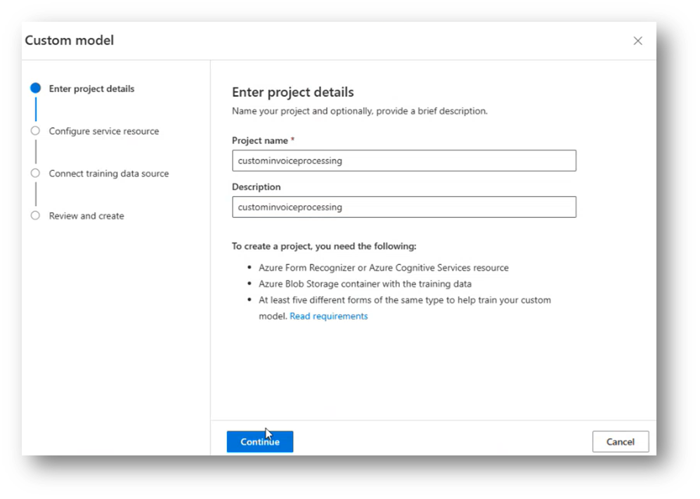
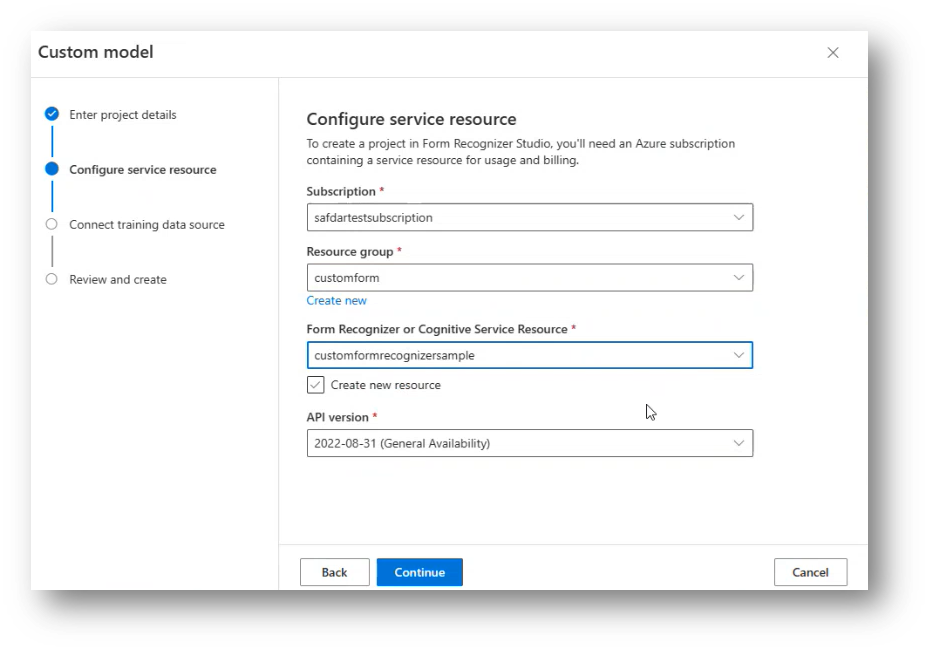
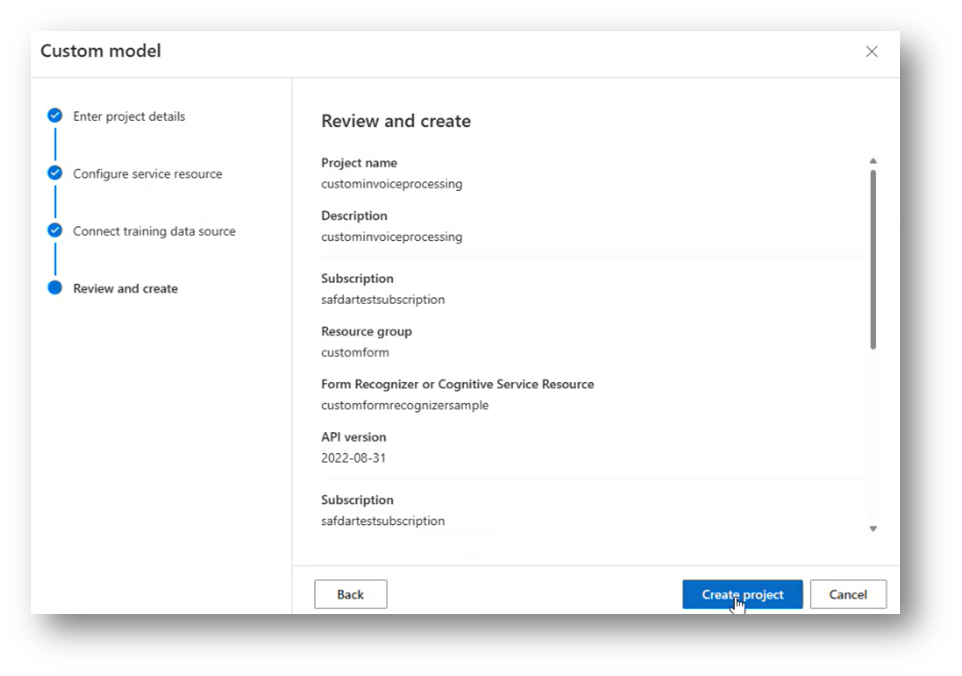
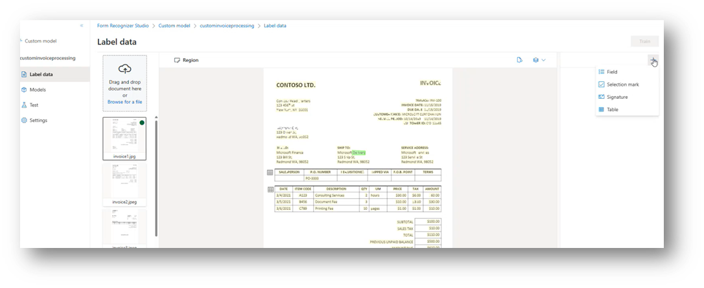
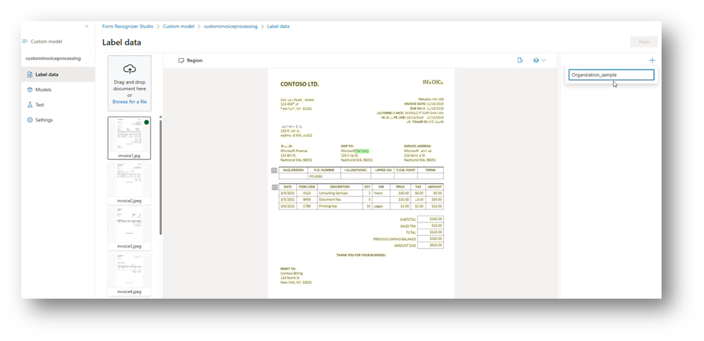
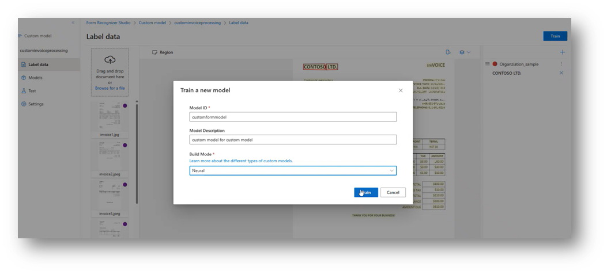
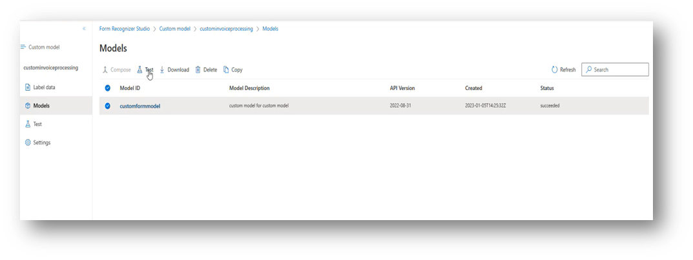

# Deploy Pre-trained Model with Business Process Automation Accelerator (BPA)

### Overview
In this lab, you will create a pipeline with the Business Process Automation Accelerator and utilize it to generate a JSON output in Azure Cosmos DB. We will create an indexer using search with this output and utilize the Sample Search Application within the BPA accelerator to search on specific aspects of the document.

### Goal
* Use a sample invoice document and utilize the BPA accelerator to use the Form Recognizer Pretrained Invoice Model
* Add an element that converts the invoice output to simpler format
* Run the pipeline with sample document and create a Search indexer of the simplified output 
* Utilize the Sample Search Application in the Accelerator to search on specific areas of the Invoice 

### Pre-requisites
* The accelerator is deployed and ready in the resource group
* You have access to sample invoices folder with the invoices to upload

### Instructions
- [Step 1 - Create a Form Recognizer Resource](#step-1---create-a-form-recognizer-resource)  
- [Step 2 - Open Form Recognizer Studio and Create a Custom Labeling Project ](#step-2---open-form-recognizer-studio-and-create-a-custom-labeling-project)  
- [Step 3 - Import the Sample Data](#step-3---import-the-sample-data)  
- [Step 4 - Train the model after labeling the forms, click on "Train" and provide the below information](#step-4---train-the-model-after-labeling-the-forms,-click-on-"train"-and-provide-the-below-information)  
- [Step 5 - Test the Model on Test Data](#step-5---test-the-model-on-test-data)  

#### Step 1 - Create a Form Recognizer Resource  
  
  
  

#### Step 2 - Open Form Recognizer Studio and Create a Custom Labeling Project 

  
  

Create Custom Model Project  

  
  

Provide the storage account and container containing the forms data which you will like to label  

  
  
  

#### Step 3 - Import the Sample Data  

  
  

Create a new field which you would like to label  

  
We created the label as "Organziation_sample"  

  

Apply the custom label to form fields  
  
Apply the labels to all forms by repeating the process in step e  
  
#### Step 4 - Train the model after labeling the forms, click on "Train" and provide the below information
  
  
#### Step 5 - Test the Model on Test Data
  
  
Load the test file and click "Analyze"  
  
The results are projected with the confidence score  
  

## References
Getting Started with Form Recognizer Studio - https://learn.microsoft.com/en-us/azure/applied-ai-services/form-recognizer/form-recognizer-studio-overview?view=form-recog-3.0.0
Form Recognizer Documentation - https://learn.microsoft.com/en-us/azure/applied-ai-services/form-recognizer/concept-invoice?view=form-recog-3.0.0
