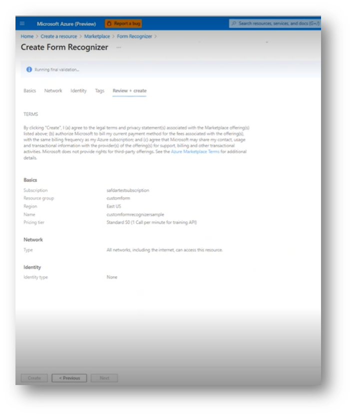
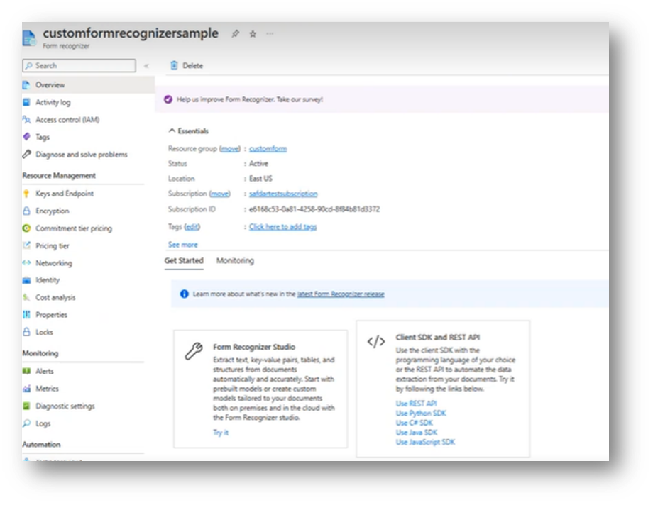
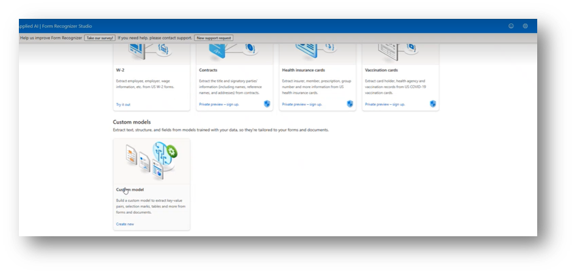
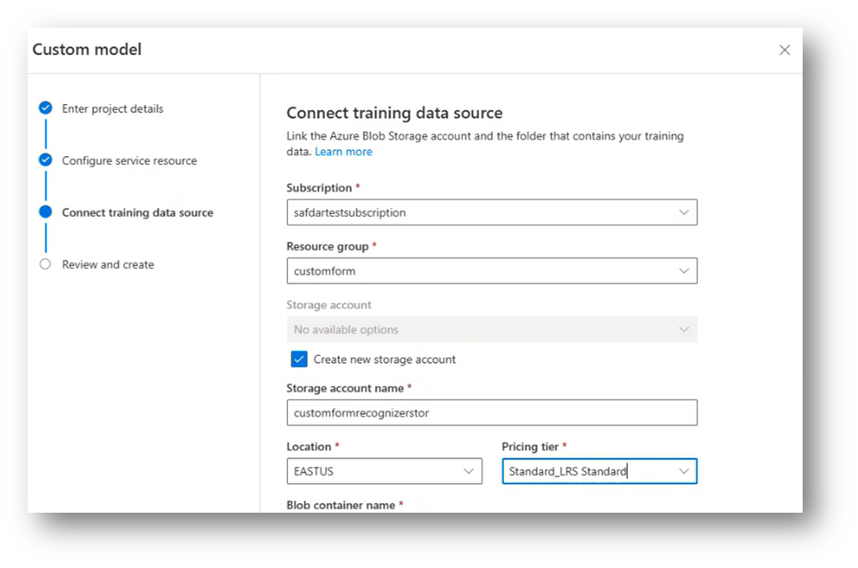
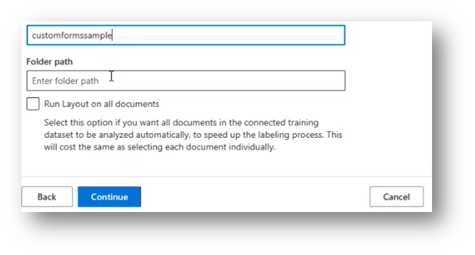
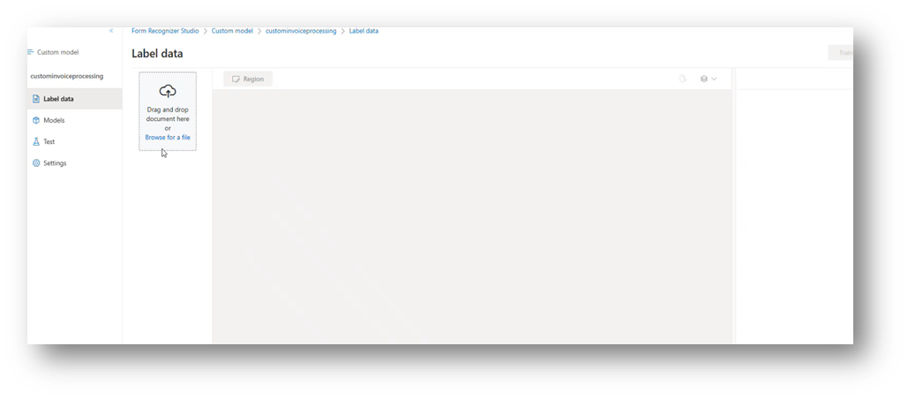
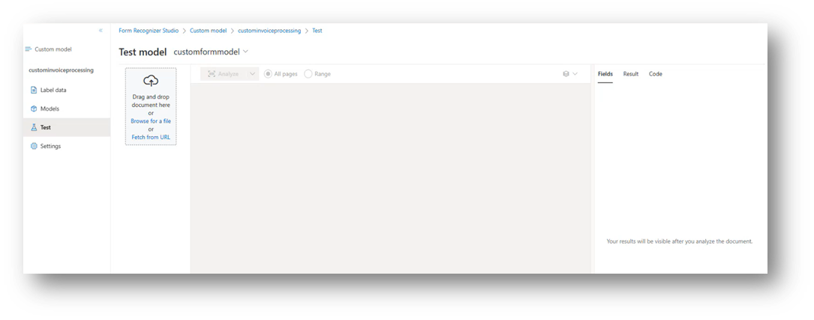
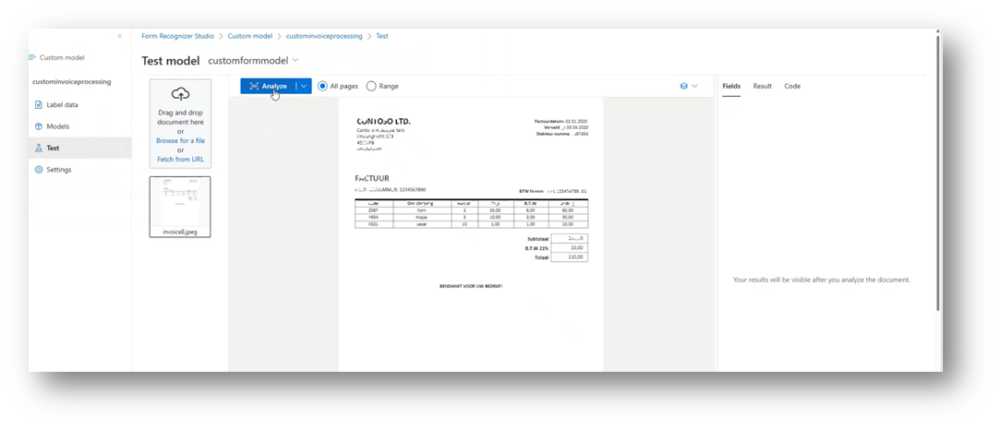

# Create and Deploy a Form Recognizer Custom Model

### Overview
In this lab, you will create (train) an Azure Form Recognizer custom model using a sample training dataset. Custom models extract and analyze distinct data and use cases from forms and documents specific to your business. To create a custom model, you label a dataset of documents with the values you want extracted and train the model on the labeled dataset. You only need five examples of the same form or document type to get started. For this lab, you will use the dataset provided at <INSERT DATA PATH>.

### Goal
* Use a sample training data set to train a custom model in the Azure Form Recognizer Studio
* Label the training data documents with custom fields of interest 
* Test the trained model on test data, visualized results and confidence score in the Studio
* Use the custom model in the BPA pipeline from Lab 1 

### Pre-requisites
* The accelerator is deployed and ready in the resource group
* You have an Azure subscription and permission to create a Form Recognizer Resource
* You have access to sample invoices folder with the invoices to upload

### Instructions

#### Create a Custom Model  
- [Step 1 - Create a Form Recognizer Resource](#step-1---create-a-form-recognizer-resource)  
- [Step 2 - Open Form Recognizer Studio and Create a Custom Labeling Project ](#step-2---open-form-recognizer-studio-and-create-a-custom-labeling-project)  
- [Step 3 - Import the Sample Data](#step-3---import-the-sample-data)  
- [Step 4 - Train the model after labeling the forms, click on "Train" and provide the below information](#step-4---train-the-model-after-labeling-the-forms,-click-on-"train"-and-provide-the-below-information)  
- [Step 5 - Test the Model on Test Data](#step-5---test-the-model-on-test-data)  

#### Build new pipeline with custom model module in BPA (using model ID)  
<insert instructions/steps here>  

#### Show new results in CosmosDB and search service (need to show some improvement vs. prebuilt)  
<insert instructions/steps here>  

#### Step 1 - Create a Form Recognizer Resource  
  
  
  

#### Step 2 - Open Form Recognizer Studio and Create a Custom Labeling Project 

  
  

Create Custom Model Project  

  
  

Provide the storage account and container containing the forms data which you will like to label  

  
  
  

#### Step 3 - Import the Sample Data  

  
  

Create a new field which you would like to label  

  
We created the label as "Organziation_sample"  

  

Apply the custom label to form fields  
  
Apply the labels to all forms by repeating the process in step e  
  
#### Step 4 - Train the model after labeling the forms, click on "Train" and provide the below information
  
  
#### Step 5 - Test the Model on Test Data
  
  
Load the test file and click "Analyze"  
  
The results are projected with the confidence score  
  

## More Resources  
Getting Started with Form Recognizer Studio - https://learn.microsoft.com/en-us/azure/applied-ai-services/form-recognizer/form-recognizer-studio-overview?view=form-recog-3.0.0  
Form Recognizer Documentation - https://learn.microsoft.com/en-us/azure/applied-ai-services/form-recognizer/concept-invoice?view=form-recog-3.0.0
